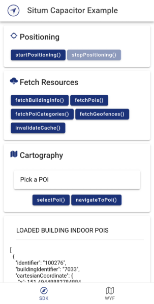
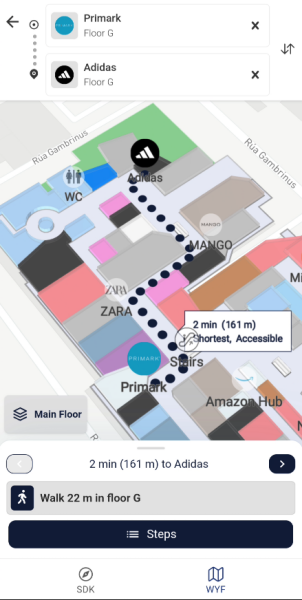

<p align="center"> 
<h1 align="center">Situm Capacitor & Cordova Example</h1>
</p>

<div align="center" style="text-align:center">

A sample Capacitor application to start learning the power of [**@situm/cordova**](https://www.npmjs.com/package/@situm/cordova).

</div>

<div align="center" style="text-align:center">

[](https://opensource.org/licenses/MIT)
[](https://www.npmjs.com/package/@situm/cordova)
[](https://www.npmjs.com/package/@situm/cordova)

</div>

## What's in here

This folder contains the source code of a Capacitor + Ionic example application using the [**Situm Cordova Plugin**](../README.md). You can also **integrate this plugin on a Cordova project**! Learn how to do it in this [section](#using-situmcordova-on-a-cordova-app).

<div align="center" style="display: flex;">
    
    
</div>

## How to run the app

### Step 1: Install the dependencies

1. The first step is to download this repo:

```bash
git clone https://github.com/situmtech/cordova.git
```

2. Then install the plugin dependencies alongside the `example` app as follows:

```bash
cd cordova/example
npm install
```

> [!TIP]
> You might want to try out this configuration if you are facing some issues to build our sample app:
>
> - node 19.8.1
> - @ionic/cli 7.1.5
> - gradle 8.4
> - java 17.0.6

### Step 2: Set up your Situm credentials

This example provides you with a template on [`src/constants.ts.example`](src/constants.ts.example) to set all your credentials used on the sdk tab just in one file. So rename this file to `constants.ts` and set up your credentials before running the app:

```typescript
export const API_USER = "YOUR_SITUM_API_USER";
export const API_KEY = "YOUR_SITUM_API_KEY";
export const BUILDING_IDENTIFIER = "YOUR_BUILDING_IDENTIFIER";
export const VIEWER_DOMAIN = "https://map-viewer.situm.com";
```

> [!NOTE]
> The credentials will also be set in the [`src/app/wyf/wyf.page.html`](./src/app/wyf/wyf.page.html) automatically in this example app. Make sure you set your credentials inside this file in your integration.

### Step 3: Run the app <a name="runapplication"></a>

From the `example/` folder, execute the following command to run the app on your device:

```bash
# For Android devices
ionic cap run android
# For iOS devices
ionic cap run ios
```

> [!NOTE]
> iOS only
>
> You might need to update the pods of this app by executing inside `example/ios`:
>
> $ pod install --repo-update
>
> Also check out the project [code signing](https://developer.apple.com/support/code-signing/) before you run the example.

You can also run the app from your IDE:

- On Android: open `example/android/` with Android Studio.
- On iOS: open `example/ios/App/App.xcworkspace` with XCode.

## Using @situm/cordova on a Cordova app

To integrate our plugin in a Cordova project, follow this 3 steps:

1. Configure your Content-Security-Policy \<meta\> tag in your `www/index.html` to be able to display our MapView on Android:

```html
<meta http-equiv="Content-Security-Policy" content="default-src 'self' data: https://ssl.gstatic.com https://map-viewer.situm.com 'unsafe-eval'; style-src 'self' 'unsafe-inline'; media-src *; img-src 'self' data: content:;" />
```

2. Configure your `config.xml` file to be able to display our MapView on iOS by adding the following \<allow-navigation\> tag:

```html
<widget>
  ...
  <allow-navigation href="https://map-viewer.situm.com/*" />
</widget>
```

3. All ready to use our plugin in a Cordova app!

```bash
cordova plugin add @situm/cordova
# For Android
cordova run android
# For iOS
cordova run iOS
```

> [!TIP]
> You might want to learn [how to create a basic Cordova app using our @situm/cordova plugin](https://situm.com/docs/a-basic-cordova-app/).

## Documentation

More information on how to use the official [**@situm/cordova**](https://www.npmjs.com/package/@situm/cordova) plugin and the set of APIs, the functions, parameters and results each function accepts and provides can be found in our [SDK API Reference](https://developers.situm.com/sdk_documentation/cordova/jsdoc/latest/situm) and [Wayfinding API Reference](https://developers.situm.com/sdk_documentation/cordova/jsdoc/latest/mapview).

### Examples

In case you want to learn how to use our plugin, you may want to take a look at our code samples of the basics functionalities:

1. [**Basic SDK and Wayfinding functionality**](./src/app/sdk/sdk.page.ts): showcases how to initialize the Situm SDK (refer to the [cordova sdk quickstart guide](https://situm.com/docs/a-basic-cordova-app/) for more information) and how to use some basic features like positioning and obtaining the information of a given building.

## Versioning

We use [SemVer](http://semver.org/) for versioning.

Please refer to [CHANGELOG.md](../CHANGELOG.md) for a list of notables changes for each version of the library.

You can also see the [tags on this repository](https://github.com/situmtech/cordova/tags).

## Submitting Contributions

You will need to sign a Contributor License Agreement (CLA) before making a submission. [Learn more here.](https://situm.com/contributions/)

## License

This project is licensed under the MIT - see the [LICENSE](../LICENSE) file for details.

## More information

More info is available at our [Developers Page](https://situm.com/docs/01-introduction/).

## Support information

For any question or bug report, please send an email to [support@situm.es](mailto:support@situm.es)
